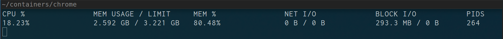

# magneto

[](https://travis-ci.org/genuinetools/magneto)

Pipe runc events to a stats TUI (Text User Interface).

## Installation

#### Binaries

- **linux** [386](https://github.com/genuinetools/magneto/releases/download/v0.2.0/magneto-linux-386) / [amd64](https://github.com/genuinetools/magneto/releases/download/v0.2.0/magneto-linux-amd64) / [arm](https://github.com/genuinetools/magneto/releases/download/v0.2.0/magneto-linux-arm) / [arm64](https://github.com/genuinetools/magneto/releases/download/v0.2.0/magneto-linux-arm64)

#### Via Go

```bash
$ go get github.com/genuinetools/magneto
```

## Usage

```console
$ sudo runc events <container_id> | magneto
CPU %   MEM USAGE / LIMIT       MEM %     NET I/O               BLOCK I/O        PIDS
1.84%   108.8 MiB / 3.902 GiB   1.38%     54.86 MB / 792.8 kB   26.64 MB / 0 B   4
```



**Usage with the `docker-runc` command that ships with docker**

```console
$ sudo docker-runc -root /run/docker/runtime-runc/moby events <container_id> | magneto
CPU %               MEM USAGE / LIMIT   MEM %               NET I/O             BLOCK I/O           PIDS
100.12%             452KiB / 8EiB       0.00%               0B / 0B             0B / 0B             2
```

```console
$ magneto --help
                                  _
 _ __ ___   __ _  __ _ _ __   ___| |_ ___
| '_ ` _ \ / _` |/ _` | '_ \ / _ \ __/ _ \
| | | | | | (_| | (_| | | | |  __/ || (_) |
|_| |_| |_|\__,_|\__, |_| |_|\___|\__\___/
                 |___/

 Pipe runc events to a stats TUI (Text User Interface).
 Version: v0.2.0
 Build: 30036e2

  -d    run in debug mode
  -v    print version and exit (shorthand)
  -version
        print version and exit
```

**NOTE:** Almost all this is the exact same as `docker stats`, so thanks to
everyone who made that possible.
